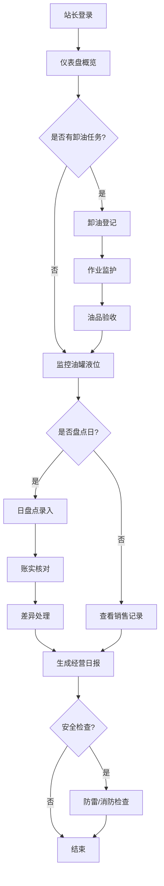

## 1. 产品概述
加油站经营管理客户端软件，面向加油站站长及管理人员，提供油品管理、加油运营、安全监控一体化解决方案。
- 核心目标：实现加油站日常运营的数字化管理，提升管理效率，保障安全运营
- 目标用户：加油站站长、运营管理人员、安全管理员
- 市场价值：替代传统手工台账，实现精细化管理，降低运营风险

## 2. 核心功能

### 2.1 用户角色
| 角色 | 注册方式 | 核心权限 |
|------|----------|----------|
| 站长 | 系统初始化创建 | 全部模块管理权限、数据导出、经营统计查看 |
| 管理员 | 站长创建 | 业务操作权限、数据录入、报表查看 |
| 安全员 | 站长创建 | 安全管理模块操作权限 |

### 2.2 功能模块
1. **油罐台账模块**：油罐液位台账、油罐信息管理
2. **进油卸油模块**：油罐车卸油登记、卸油作业监护
3. **加油销售模块**：加油机销售记录、油枪计量校验
4. **油品盘点模块**：日盘点账实核对、油品库存管理
5. **会员储值模块**：会员储值消费、积分兑换
6. **安全管理模块**：加油站防雷防静电、消防设施检查、视频监控
7. **经营统计模块**：经营日报、数据统计分析

### 2.3 页面详情
| 页面名称 | 模块名称 | 功能描述 |
|----------|----------|----------|
| 首页仪表盘 | 经营统计 | 关键指标概览、今日销售、库存预警、安全提醒 |
| 油罐台账 | 油罐台账 | 油罐列表、实时液位、温度、容积展示，历史记录查询 |
| 进油卸油 | 进油卸油 | 卸油登记表单、油罐车信息、油品验收、作业监护记录 |
| 加油销售 | 加油销售 | 加油机销售记录查询、油枪计量校验登记、销售明细 |
| 油品盘点 | 油品盘点 | 日盘点录入、账实核对差异分析、盘点报表 |
| 会员管理 | 会员储值 | 会员信息、储值记录、消费记录、积分兑换管理 |
| 安全管理 | 安全管理 | 防雷防静电检查、消防设施检查、视频监控画面 |
| 经营报表 | 经营统计 | 经营日报、销售趋势、库存分析、利润统计 |

## 3. 核心流程

### 3.1 日常运营流程
站长登录系统 → 查看仪表盘确认库存和销售情况 → 如有卸油任务则登记卸油记录 → 实时监控油罐液位 → 每日进行油品盘点 → 查看经营日报 → 定期进行安全检查

### 3.2 会员服务流程
会员开户 → 储值充值 → 加油消费 → 积分累计 → 积分兑换礼品

### 3.3 安全管理流程
制定安全检查计划 → 执行防雷防静电检查 → 消防设施定期检查 → 记录检查结果 → 隐患整改跟踪

### 3.4 流程图

## 4. 用户界面设计

### 4.1 设计风格
- 主色调：深蓝色(#1e3a5f)代表专业稳重，橙色(#f59e0b)作为强调色代表能源活力
- 辅助色：深灰(#374151)、中灰(#6b7280)、浅灰(#f3f4f6)
- 按钮风格：圆角矩形，主按钮深蓝色渐变，悬停有微动画效果
- 字体：标题使用"Noto Sans SC"粗体，正文使用"Noto Sans SC"常规
- 布局：左侧导航栏 + 顶部状态栏 + 主内容区的经典企业管理系统布局
- 图标：使用统一线性图标，重要功能使用彩色图标区分
- 整体风格：工业感、专业稳重、数据可视化突出

### 4.2 页面设计概述
| 页面名称 | 模块名称 | UI元素 |
|----------|----------|--------|
| 仪表盘 | 经营统计 | 数据卡片、柱状图、折线图、饼图、预警提示条、快捷操作区 |
| 油罐台账 | 油罐台账 | 油罐可视化展示、液位进度条、实时数据表格、历史趋势图 |
| 进油卸油 | 进油卸油 | 步骤表单、时间线、油罐车信息卡片、验收检查表 |
| 加油销售 | 加油销售 | 数据表格、筛选器、油枪状态卡片、校验记录表 |
| 油品盘点 | 油品盘点 | 盘点表单、差异对比表、盈亏分析图表 |
| 会员管理 | 会员储值 | 会员列表、储值记录、消费明细、积分兑换面板 |
| 安全管理 | 安全管理 | 检查清单、设备状态卡、监控画面网格、整改记录 |
| 经营报表 | 经营统计 | 多维度筛选器、报表表格、趋势图表、导出按钮 |

### 4.3 响应式
- 桌面端优先设计，支持1920×1080及以上分辨率
- 平板端自适应，导航栏可折叠
- 主要数据表格支持横向滚动
- 触控设备优化按钮尺寸和点击区域

### 4.4 数据可视化
- 使用ECharts实现销售趋势图、库存分析图
- 油罐液位使用自定义进度条和仪表盘展示
- 经营数据使用热力图展示销售高峰时段
- 安全检查结果使用状态色标系统标识
