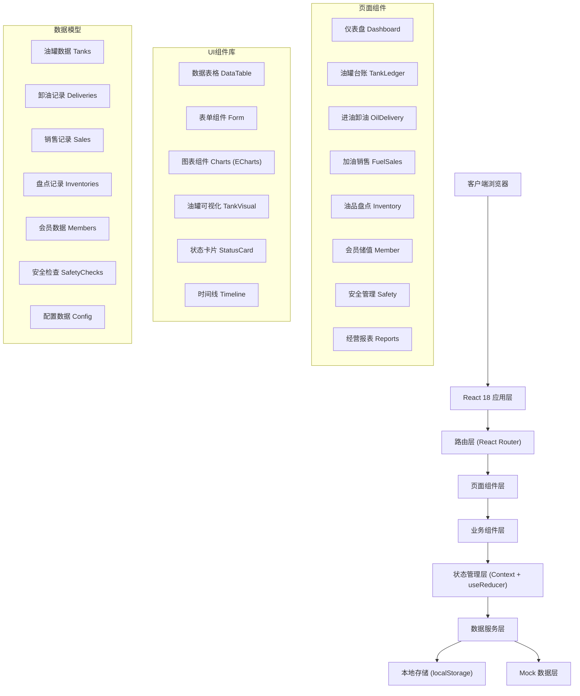
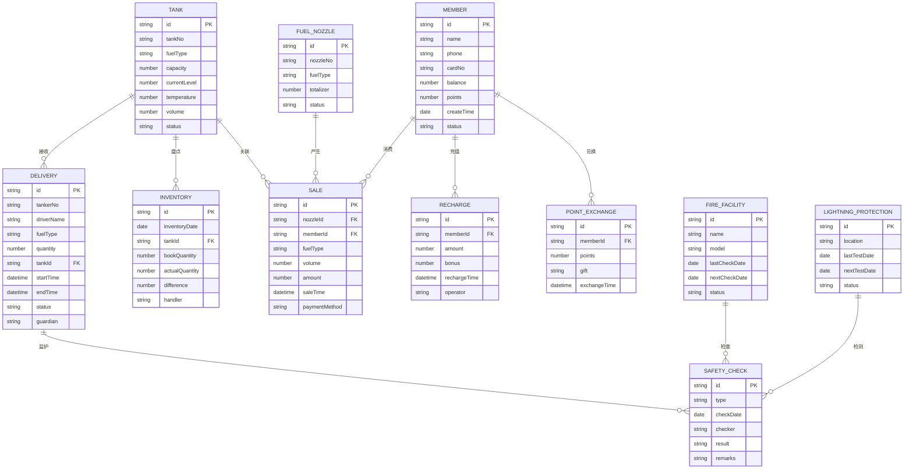

## 1. 架构设计



## 2. 技术描述

- **前端框架**: React@18.2.0 + TypeScript@5.3.0
- **构建工具**: Vite@5.0.0
- **样式方案**: TailwindCSS@3.4.0 + PostCSS
- **路由管理**: React Router DOM@6.20.0
- **图表可视化**: ECharts@5.4.3 + echarts-for-react@3.0.2
- **图标库**: Lucide React@0.294.0
- **状态管理**: React Context + useReducer (轻量级方案)
- **表单处理**: React Hook Form@7.48.0
- **日期处理**: date-fns@2.30.0
- **数据持久化**: localStorage (客户端存储)
- **代码规范**: ESLint + Prettier

## 3. 路由定义

| 路由路径 | 页面组件 | 功能说明 |
|----------|----------|----------|
| `/` | Dashboard | 首页仪表盘，关键指标概览 |
| `/tank-ledger` | TankLedger | 油罐台账，液位监控 |
| `/oil-delivery` | OilDelivery | 进油卸油管理 |
| `/fuel-sales` | FuelSales | 加油销售记录 |
| `/inventory` | Inventory | 油品盘点管理 |
| `/members` | MemberManagement | 会员储值管理 |
| `/safety` | SafetyManagement | 安全管理模块 |
| `/reports` | BusinessReports | 经营统计报表 |

## 4. 数据模型

### 4.1 实体关系图



### 4.2 数据初始化

系统首次运行时自动初始化Mock数据，包含：
- 4个油罐（92#、95#、98#汽油各1个，0#柴油1个）
- 8支加油枪
- 20条销售记录
- 10条卸油记录
- 50个会员
- 30条储值记录
- 5条盘点记录
- 安全检查基础数据

## 5. 项目目录结构

```
src/
├── assets/              # 静态资源
│   ├── images/
│   └── icons/
├── components/          # 公共组件
│   ├── layout/         # 布局组件
│   │   ├── Sidebar.tsx
│   │   ├── Header.tsx
│   │   └── Layout.tsx
│   ├── ui/             # UI基础组件
│   │   ├── DataTable.tsx
│   │   ├── StatusCard.tsx
│   │   ├── TankVisual.tsx
│   │   ├── Chart.tsx
│   │   └── Modal.tsx
│   └── common/         # 通用业务组件
├── pages/              # 页面组件
│   ├── Dashboard/
│   ├── TankLedger/
│   ├── OilDelivery/
│   ├── FuelSales/
│   ├── Inventory/
│   ├── Members/
│   ├── Safety/
│   └── Reports/
├── store/              # 状态管理
│   ├── types.ts
│   ├── context.tsx
│   └── reducers/
├── services/           # 数据服务
│   ├── mockData.ts
│   ├── storage.ts
│   └── api.ts
├── utils/              # 工具函数
│   ├── date.ts
│   ├── number.ts
│   └── validator.ts
├── hooks/              # 自定义Hooks
│   ├── useLocalStorage.ts
│   └── useChartData.ts
├── router/             # 路由配置
│   └── index.tsx
├── styles/             # 全局样式
│   └── index.css
├── types/              # 类型定义
│   └── index.ts
├── App.tsx
└── main.tsx
```

## 6. 核心功能实现要点

### 6.1 油罐液位实时监控
- 使用CSS动画模拟液位变化效果
- 自定义SVG组件实现油罐可视化
- 实时计算容积和库存预警

### 6.2 数据可视化
- 集成ECharts实现销售趋势图、库存分析图
- 自定义主题配色与整体UI风格统一
- 支持图表数据导出

### 6.3 表单处理
- 使用React Hook Form实现表单验证
- 多步骤表单支持（卸油登记流程）
- 表单数据自动保存草稿

### 6.4 数据导出
- 支持Excel格式导出（使用xlsx库）
- 报表打印功能
- PDF导出（可选）
